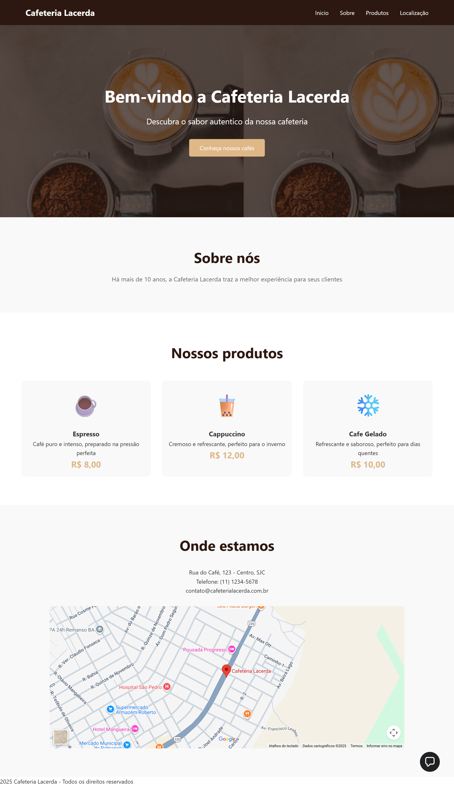

# ☕ Cafeteria Lacerda


Um site simples e elegante desenvolvido para apresentar a **Cafeteria
Lacerda**, destacando sua história, produtos, localização e informações
de contato.

------------------------------------------------------------------------

## 🖥️ Tecnologias Utilizadas

-   **HTML5** --- estrutura e conteúdo da página\
-   **CSS3** --- estilização e layout responsivo\
-   **Google Maps Embed** --- exibição do mapa com a localização da
    cafeteria

------------------------------------------------------------------------

## 📂 Estrutura do Projeto

    /
    ├── index.html          # Página principal do site
    ├── styles.css          # Arquivo de estilos CSS
    ├── img/
    │   └── inicial.png     # Imagem de demonstração da cafeteria

------------------------------------------------------------------------

## 🧭 Seções do Site

### 🏠 Início

Apresenta uma seção de boas-vindas com um banner e um botão para
conhecer os produtos.

### 👩‍🍳 Sobre Nós

Conta um breve histórico da cafeteria e destaca sua tradição em oferecer
cafés de qualidade há mais de 10 anos.

### ☕ Produtos

Exibe uma seleção de cafés: 
- **Espresso** --- R\$ 8,00\
- **Cappuccino** --- R\$ 12,00\
- **Café Gelado** --- R\$ 10,00

Cada produto é apresentado com ícone, descrição e preço.

### 📍 Localização

Mostra o endereço, telefone, e-mail e um mapa interativo do Google Maps:
\> Rua do Café, 123 - Centro, São José dos Campos\
\> Telefone: (11) 1234-5678\
\> E-mail: contato@cafeterialacerda.com.br

### ⚙️ Rodapé

Inclui os direitos autorais da Cafeteria Lacerda.

------------------------------------------------------------------------

## 🎨 Destaques do Design

-   **Navbar fixa:** mantém o menu visível durante a rolagem.\
-   **Layout responsivo:** adaptável para diferentes tamanhos de tela.\
-   **Hover Effects:** animações suaves nos botões e cards de produtos.\
-   **Paleta de cores:** tons terrosos e aconchegantes (marrom, bege,
    branco).

------------------------------------------------------------------------

## 🚀 Como Executar o Projeto

1.  Baixe ou clone este repositório:

    ``` bash
    git clone https://github.com/usuario/cafeteria-lacerda.git
    ```

2.  Abra o arquivo `index.html` em qualquer navegador.\

3.  (Opcional) Hospede o site em uma plataforma como **GitHub Pages**,
    **Netlify** ou **Vercel**.

------------------------------------------------------------------------

## 📸 Demonstração



------------------------------------------------------------------------

## 👨‍💻 Autor

**Carlos Lacerda**\
Estudante de Ciência da Computação --- apaixonado por tecnologia, design
e café ☕

------------------------------------------------------------------------

## 📝 Licença

Este projeto é de uso livre para fins educacionais e de portfólio.
